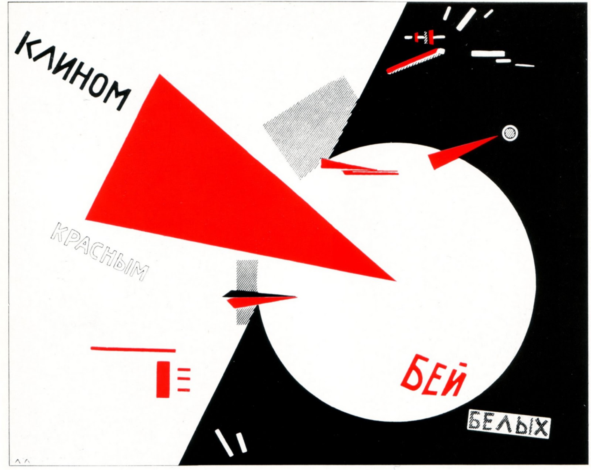

# Clase 01

- Presentación equipo docente
- Horarios de asistencia
- Programa del curso
- Bitácoras (inicialmente en p5.js, luego en GitHub)
- Calendario comprimido
- Revisión sobre el artista [Sol Lewitt](https://es.wikipedia.org/wiki/Sol_LeWitt)
  - Encontrar alguna obra y comentar el proceso de trabajo y su relevancia (1 párrafo)
  - Incluir un comentario personal ¿qué te llama la atención? ¿por qué?
  - Citar fuente donde se encontró la obra. Incluir título de libro o página web, autor, fecha de publicación, número de página (libro físico) o URL (página web)
  - Completar en un documento de Google Docs en su propia cuenta de Drive. Las instrucciones de entrega se darán en la primera clase.

- Aprender a navegar el entorno de p5.js
- Estructura js y html
  - ¿Qué es html?
  - ¿Qué es js?
- Mis primeros códigos
  - Hola Mundo
  - Primitivas
  - Modificación de primitivas
  - Color
  - Texto

- Referencias libro constructivismo ruso: [constructivismo.md](constructivismo.md)

## apuntado por stgo

### sesion-01

DIS09214

2026-03-20

primera clase kemosión

Rep180. Lab 12

#### presentacion

Matías es sonidista, y magister en artes
mediales. Ahora en proceso de doctorado en artes y humanidades.

Hace clases en artes y en diseño.

#### cátedra

el diseño no es una caja en la que te encasillan y que te limita. Es una manera de pensar, flexible y permeable a otra disciplinas, pueden moverse.

En el area solemos usar GitHub. Es una web donde se alojan repos, siendo repo = carpetas. En ellas tu puedes meter toda la info y archivos de un proyecto. este semestre tendremos un repo del curso.

En este curso trabajaremos con el [editor p5js](https://editor.p5js.org)

##### formalidades

tendremos 2 solemnes y un examen.

hay muchos feriados y receso y cosas los viernes, así que iremos en modo pro.

- solemne-01 - 10 de abril:

se entrega fuera de clases. Hay solo 2 clases para preparar la solemne-01

- solemne-02 - 29 de mayo:

interrogación oral. La idea de esto es comprobar que la información relevante se integre en la mente de los estudiantes.

- **examen - 26 de junio**

Es importante acreditar procesos, trackear avances y esto es parte del curso. Se tendrá en cuenta esto para las evaluaciones.

Por parte del equipo docente, toda la documentación estará disponible en el [repo del curso](https://github.com/disenoUDP/dis09214-2026-1-seccion-5).

#### pensamiento computacional

¿porqué se llama así?

el foco está en el sujeto de la frase, "pensamiento". LO importante es adquirir herramientas reflexivas. La computación puede entenderse como una manera de pensar.

How to speak machine: cuenta la historia de la programación, antes, el computador era un oficio, una persona que computaba cálculos. La computación tiene que ver ocn eso.

Es importante que aprendan de computación por el context histórico actual en el que vivimos.

Google images, Instagram, YouTube, el excel de la lista, los estudiantes en la sala ¿Qué tienen en común? Están organizados en formato de grilla.

Para la U, somos nuestro rut, el curso es un código (DIS09214), para que la U considere que pasaste un curso, necesita un dato, una nota. Y así es como funciona el mundo computacional. Todo son datos

Ejemplo, las imágenes son una tabla de excel. Están hecha por pequeños datos llamados pixeles.

Casi todas la estructuras sociales de la actualidad son tablas de excel. Pero sí existen cosas más allá de eso, todo lo que asociamos con lo "humano".

##### lógica computacional

¿qué es un algoritmo?

es un método de resolución de problemas. El hecho de planificar es algorítmico. Ejemplo planificar cómo irse a la casa es un algoritmo: salir de un edificio, tomar la micro, caminar, parar en el semáforo, etc.

Etimológicamente viene de [al-Khwārizmī](https://en.wikipedia.org/wiki/Al-Khwarizmi) un matemático de alrededor del año 800. (es el que sale en la portada de la [álgebra de baldor](https://es.wikipedia.org/wiki/Álgebra_de_Baldor))

los algoritmos tienen mucho que ver con la estadística, y de ahí viene la palabra Estado.

##### antecedente de la computación

[Telar de Jacquard](https://es.wikipedia.org/wiki/Telar_de_Jacquard): una de las primera implementaciones de la lógica del código, fue con fines textiles.

Una lógica similar fue utilizada en [Bombe](https://en.wikipedia.org/wiki/Bombe), máquina creada por [Alan Turing](https://en.wikipedia.org/wiki/Alan_Turing) en 1945, se dice que está máquina permitió acortar entre 2-4 años la guerra, salvando entre 14-21 millones de vidas. Posteriormente, Turing fue perseguido y hostigado por "actos de homosexualidad". Alan Turing se suicidó en 1954.

[Ada Lovelace](https://en.wikipedia.org/wiki/Ada_Lovelace): una matemática hija del poeta [Lord Byron](https://es.wikipedia.org/wiki/Lord_Byron). Tuvo mucho que ver con la implementación de las primeras calculadora. Imaginó cómo funcionarían los algoritmos 150 años antes de que sus ideas pudieran ser implementadas.

Los computadores son la implementación eléctrica de la lógica de los algoritmos.

#### sol levitt

qué descubrieron?

respuestas:

- hacía instrucciones, no la obra en sí
- concepto
- sistemas de módulos

él trabajaba en un estudio de sueño y se dio cuenta que en el arte él tenía que hacer las cosas, pero se comparaba con los arquitectos, quienes hacen la planificación y luego otres ejecutaban la obra. ¿Porqué yo tengo que realizar mi propia obra?¿Por qué no puedo ser como una compositora o un coreógrafo?

analizamos la obra de los cubos. La cual inspiró problemas matemáticos.

Sol Lewitt, tiene muchas series, con obras enumeradas.

wall drawing 118: conjunto de instrucciones precisas.

esto recuerda a un poema. La lógica de líneas es algo muy computacional. SI lo vemos es como un prompt pero separado por lineas, un prompt siendo más "vibe".

: esta obra cambia, busca ser plasmada de forma óptima independiente del lugar. Siempre es distinta pq se adapta a la arquitectura.

Sol Lewitt implementaba mucho en el papel, y que la ejecución fuera por humanos. Esto fue aprox en los 60's. En esa época había mucha lógica relacionada al concepto.

## post break

hablamos del LID, del server de discord, a tarea fue meterse al discord y saludar con su nombre real y su sección.

En el pasado, cuando querías ir al internet, ibas. Ahora se te cruza aunque no quieras.

En el canvas hay una tarea, deben subir el link de tu tarea de hoy.

Trabajaremos con un software que existe en el navegador. P5js es un entorno de programación y ala vez una librería de javascript. UN lenguaje de prog es texto que me permite acceder al computador por medios más similares al lenguaje natural.

En e entorno p5js es similar a las instrucciones de Sol Lewitt, pero en vez de estudiantes de arte mal pagados, lo hace el computador,

Sintaxis: es una forma de escribir. En los computadores es MUY ESTRICTO. tiene el objetivo de coordinarnos con el lenguaje binario. Sí podríamos escribir en binario, pero sería mucho mas complejo y locura.

Photoshop por ejemplo, también funciona de esta manera, solo es distinta la interfaz. Esto es lo que se entiende como "niveles de lenguaje". Mientras más lejano a los 0 y 1 más de "alto nivel" se le considera. Ejemplo de alto nivel(las ias generativas en base a prompts). Un ejemplo de bajo nivel sería "BASIC" o "ASSEMBLY".

Uno de los lenguajes más famosos es C.

a través del entorno de p5 podemos emplear el pensamiento computacional. Este no es un curso de p5.

p5 es gratuito y open source. Creado por Lauren Mcarthy.

### en p5js

Al lado izquierdo vemos el código, donde escribimos lo que queremos que pase.

Arriba tenemos el botón de play y stop.

un lenguaje de programación siempre lee en orden las líneas que escribas.

realizaciones:

1. print: aprendizajes: lo que sale en la consola no va a  aparecer en canvas
2. orden de las líneas
3. comentarios: libertad, el código se lo salta
4. guardar y nombrar: esto es solo texto guardado en un link, no se guarda en tu pc. es muy liviano
5. compartir: link de ver y editar, lo usaremos para bitácora por hoy
6. funciones: las funciones tienen argumentos, cosas que te "pide"
    1. [createCanvas();](https://p5js.org/reference/p5/createCanvas/): debe estar dentro del setup
    2. colores: RGB, 1 argumento vs 3 argumentos
    3. [line();](https://p5js.org/reference/p5/line/); : puntos de origen y punto de destino. (x, y)
    4. [ellipse();](https://p5js.org/reference/p5/ellipse/): formas cuyos puntos todos están a la misma dist del centro. (x,y,w,h)
    5. [square();](https://p5js.org/reference/p5/square/): (x, y, cara)
    6. [fill();](https://p5js.org/reference/p5/fill/)
    7. [noFill();](https://p5js.org/reference/p5/noFill/)
    8. [stroke();](https://p5js.org/reference/p5/stroke/)
    9. [noStroke();](https://p5js.org/reference/p5/noStroke/)
7. lienzo p5: ancho y alto en pixeles. (0,0) (400, 300)
8. [documentación p5js](https://p5js.org)

## encargo-01

. Crear un sketch usando formas primitivas, fill, stroke. Opcionalmente pueden usar otras funciona de p5js aún no vistas en clase. Usar como referentes el [constructivismo ruso](https://es.wikipedia.org/wiki/Constructivismo_(arte)) y el [suprematismo](https://es.wikipedia.org/wiki/Suprematismo)

luego esto será un recurso para la solemne-01. Se usarán design manifiestos como texto.

- Investigar figuras primitivas
- colores, trazos

### links relevantes

- [sitio específico](https://www.composition.gallery/ES/glosario/qu-es-el-arte-de-sitio-especfico/)
- [video mapping](https://en.wikipedia.org/wiki/Projection_mapping)
- [amy goodchild](https://www.amygoodchild.com)
- [amy goodchild - sol lewitt - chatgpt](https://www.amygoodchild.com/blog/chatgpt-sol-lewitt-wall-drawings)
- [fluxus](https://es.wikipedia.org/wiki/Fluxus)
- [Vera Molnar](https://en.wikipedia.org/wiki/Vera_Molnár)arte computacional en los 60, geométrico, siccodélico.
- [Mamfred Mohr](https://www.emohr.com): cubos , similar a SOl Lewitt
- [blog de referentes de arte computacional de los 50 y 60](https://www.amygoodchild.com/blog/computer-art-50s-and-60s)
- [arte algorítmico](https://es.wikipedia.org/wiki/Arte_algorítmico)
