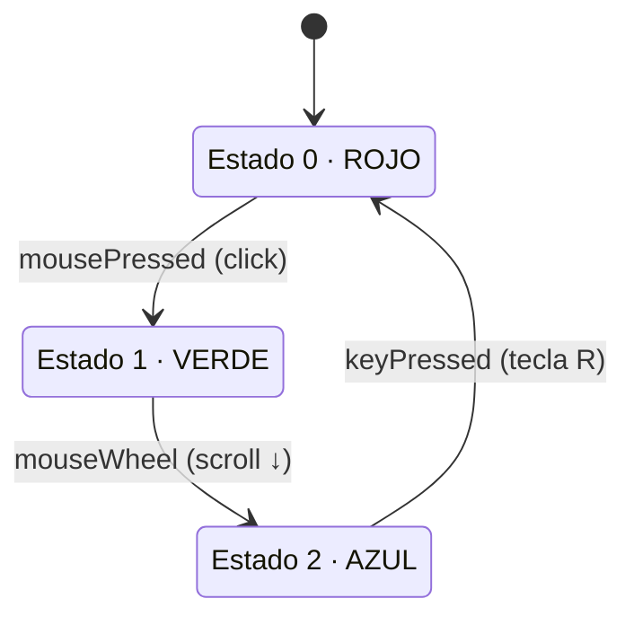

# sesion-09

2026-06-05

Matías preparó un sketch de ejemplo de cómo hacer una máquina de estados.

- [Ejemplo máquina de estados](https://editor.p5js.org/matilov/sketches/rMnYDHPPY)

## relevante

- <https://mariavaldebenitog-byte.github.io/micxvg/>

- [keyCode](https://p5js.org/reference/p5/keyCode/)

- [sketch clase de hoy](https://editor.p5js.org/matilov/sketches/S1OTCHPyJ)

## para examen

Crear un relato interactivo basado en una máquina de estados

Se puede hacer por grupos:

- Para grupos de 1 persona, el mínimo es de 3 estados
- Para grupos de 2 personas, el mínimo es de 6 estados
- Para grupos de 3 personas, el mínimo es de 9 estados

Instrucciones y consejos para este examen

- El relato debe estar basado en una cita (literaria, a una película, a un poema, a un mito, etc.)

- Hacer proyecto en un repositorio NUEVO en github. Incluir a sus compañer@s como colaboradores

- Publicar dibujos de storyboard en github

- Usar `createCanvas(windowWidth, windowHeight);`

- Publicar proyecto en Github Pages

- Procuren que las interacciones sean coherentes con el relato