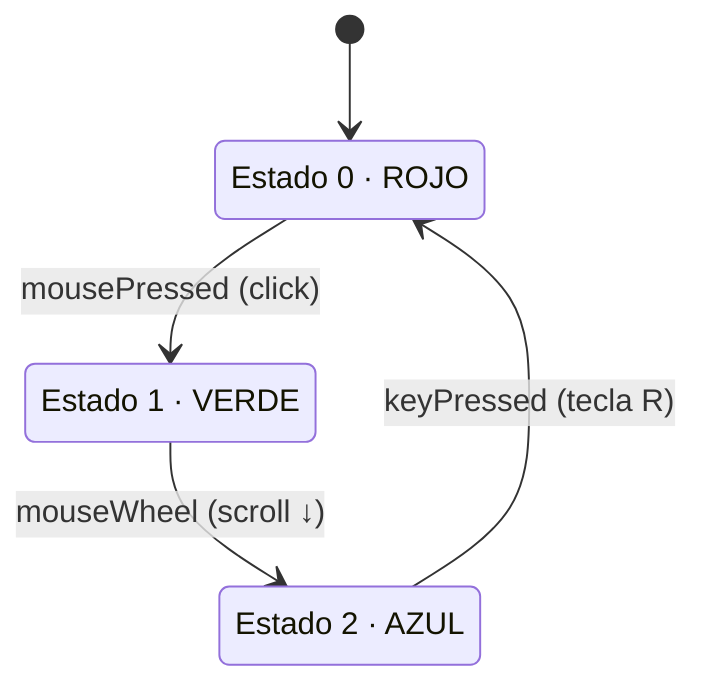

# sesion-09

2026-06-05

Matías preparó un sketch de ejemplo de cómo hacer una máquina de estados.

- [Ejemplo máquina de estados](https://editor.p5js.org/matilov/sketches/rMnYDHPPY)

## relevante

- <https://mariavaldebenitog-byte.github.io/micxvg/>

- [keyCode](https://p5js.org/reference/p5/keyCode/)

- [sketch clase de hoy](https://editor.p5js.org/matilov/sketches/S1OTCHPyJ)
